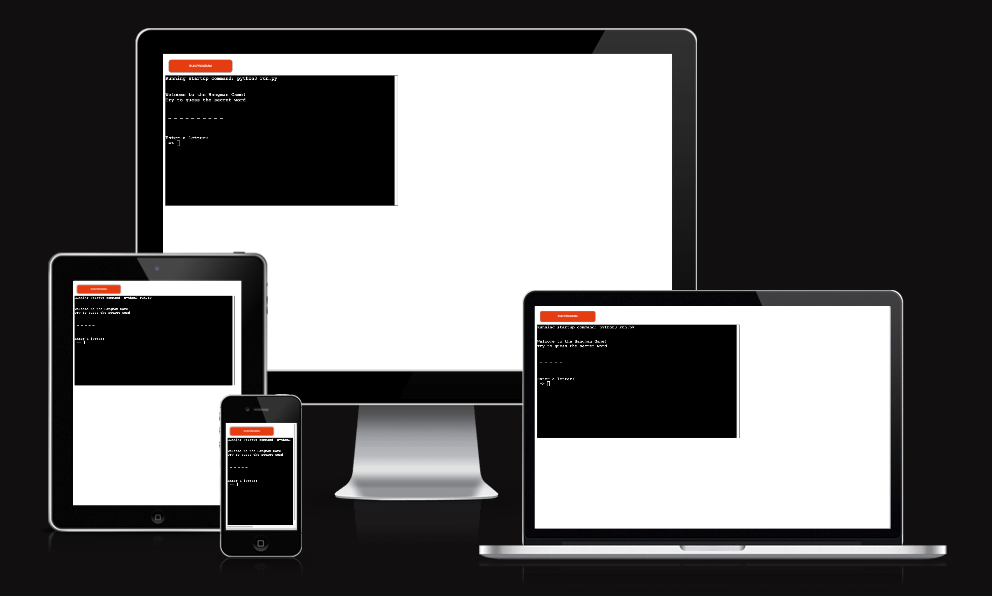
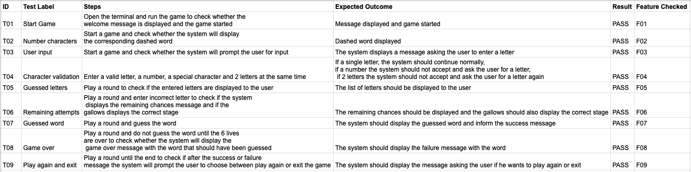
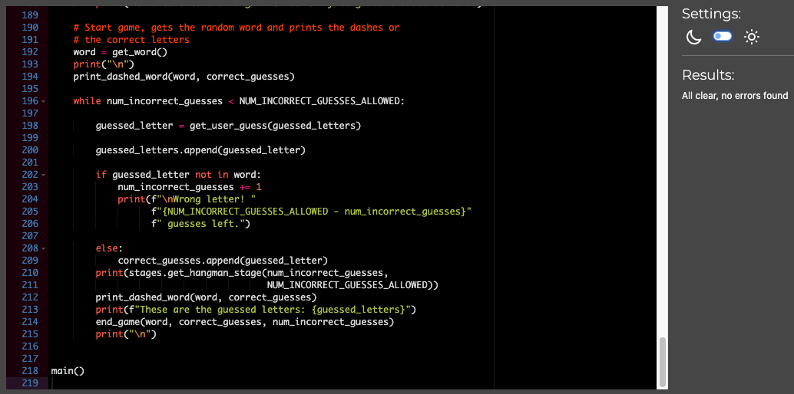
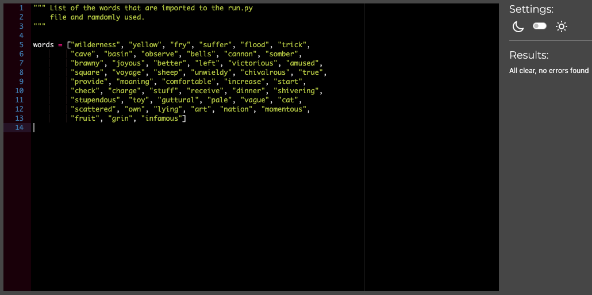
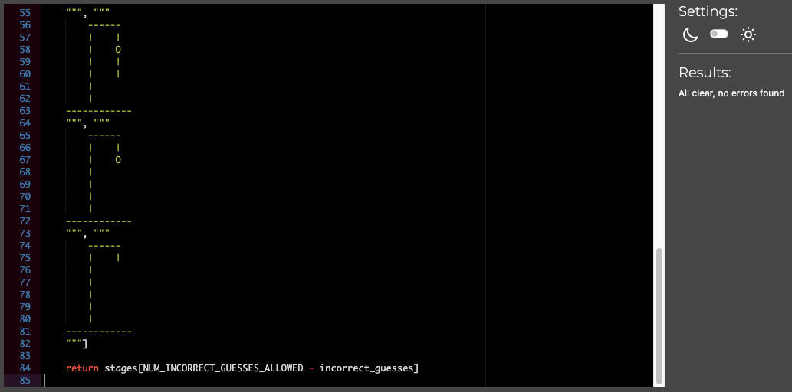

# The Hangman game
## Project Portfolio 3

[Link to Heroku app](https://ujuniordev-hangman-pp3.herokuapp.com/)

[Link to GitHub repository](https://github.com/ujuniordev/hangman-game-pp3)

Would you like to have some fun by playing the classic word guessing game? 
This project was developed in Python and runs on the terminal.

## About the game

The Hangman is a classic word guessing game. 
In this version, it requires nothing more than the ability to spell. The system, who can be called the host player makes up a secret word, while the other player tries to guess the word by entering the letters he thinks the word contains. However, every wrong guess brings them one step closer to losing.

If the guessing player suggests a letter which occurs in the word, the system displays it in all its correct positions. If the suggested letter does not occur in the word, the system removes a chance/life and displays the stage of the hangman. The  game ends once the word is guessed, or if the lives are over — signifying that all guesses have been used.

## User experience

The main goal of the project was to have a clean, simple and intuitive interface to easily guide the user throughout the game until the word is guessed or the chances are over.
The user stories that were used to develop the game are listed below:

 - **US 01 Start game**
As a user, I want to be able to start the game by running the terminal
 - **US 02 Number of characters**
As a user, I want to be able to see the number of characters that composes the word to be guessed
 - **US 03 User input**
As a user, I want to be able to enter single letters to guess the word
 - **US 04 Valid characters**
As a user, I want to be informed when my input is not valid
 - **US 05 Guessed letters**
As a user, I want to be informed what were the letters that I entered and which of them are correct
 - **US 06 Remaining attempts**
As a user, I want to be informed about how many attempts I have left to guess the word
 - **US 07 Guessed word**
As a user, I want to be informed when I have guessed the word
 - **US 08 Game over**
As a user, I want to be informed what was the word I had to guess when my chances were over
 - **US 09 Play again and exit**
As a user, I want to be able to play again and to exit the game once it is over

## Features

This website contains the following features that were developed considering the user's stories listed in the section User experience above:
 - **F1 Start Game (using US01)**
As soon as the user enters the terminal the game is started and a message is displayed asking the user for his input
 - **F2 Number of characters (using US02)**
When the user starts the game by entering the terminal, the word is randomly selected by the program from the words list and displayed to the user as dashes so the user can see what are the number of characters that composes the word
 - **F3 User input (using US03)**
Once the game has started the system prompts the user for input and displays the message to enter a letter
 - **F4 Valid characters (using US04)**
After the user enters a letter the system checks if the letter is valid, if it is an alphabetical single letter. If not, then a message is displayed to the user asking to enter a valid letter
 - **F5 Guessed letters (using US05)**
During the lifecycle of the game session the system stores a list with the letters that the were entered and displays them to the user. The correct letters are added to the dashed word in its relative position. The incorrect letters are added to the list and displayed to the user. A message is shown to inform the user when the guess was wrong
 - **F6 Remaining attempts (using US06)**
Whenever the user enters a incorrect letter, a message is displayed informing that it was wrong with the remaining chances and the gallows also displays the stage of the hangman. Once the chances are over, the hangman is completed and the game is over
 - **F7 Guessed word (using US07)**
If the word is guessed the system displays a success message to the user with the word
 - **F8 Game over (using US08)**
If the word is not guessed within 6 chances the game is over, a message is displayed informing the user what was the word
 - **F9 Play again and exit (using US09)**
When the game is over either by success or failure, the user is prompted to restart or exit the game

### Features to be implemented

- Add colors to improve the user experience
- Make it possible for the user to share his score on social networks
- Allow the user to save his progress

## Design

As the game is played on the terminal, the focus was on providing a clean intuitive interface by giving enough good spacing between the sentences and making it clear for the user where his input was requested. Also, the gallows helps the user to identify the stage of the game where he is at. 

## Technologies
 - Python
 
## Frameworks, Programs and code websites references used during the implementation

### Frameworks
 - [Git](https://git-scm.com/) was used for version control through [Gitpod](https://gitpod.io/) terminal, using CLI git commands to commit and push to GitHub
 - [GitHub](https://github.com/) is used as the repository for the entire project
 - [Heroku](https://www.heroku.com/) was used to deploy the application as it runs on the terminal
### Programs
 - [Am I Responsive](https://ui.dev/amiresponsive) was used to add the images of how the game is displayed in different devices
### Code
- During the implementation of the website, it was made necessary to look for examples and of code and different ways to achieve the required goal. Therefore a couple of community websites were used, such as the [W3C Schools website](https://www.w3schools.com/) that was extensively used to check the syntax and code examples
- [Codefather website](https://codefather.tech/) was used to help with the hangman stages function
- [Stack Overflow](https://stackoverflow.com/) was also referenced to check Python function methods and iteration methods
- And of course, the [Code Institute LMS](https://learn.codeinstitute.net/) was extensively used especially the Python essentials module

 ## Testing

The testing plan was based on the features described for the website

### Code Validation

 - To check the PEP8 requirements of the program, I used the [CI Python Linter](https://pep8ci.herokuapp.com/) 
 - The results are as follows:
 
	 - run.py file

	 - words.py file

	 - stages.py file

## Deployment

The project was deployed using the Heroku mock terminal from Code Institue. 
The steps for deployement are as follows:

- Fork or clone this GitHub repository
- Log in to Heroku and create new app".
- Under the "settings" tab you will find the Config Vars.
- Add the following Config Var 
  - key: PORT 
  - value: 8000
- Scroll down and add buildpack.
  - First add "python" and then add "nodejs". They should be in this order. 

## Acknowledgements

A heartful thank you to Brian Macharia for menthor support, guidance, and tips to improve my coding skills throughout the project.
Also huge thank you to my family for being so supportive and patient during the entire program so far.